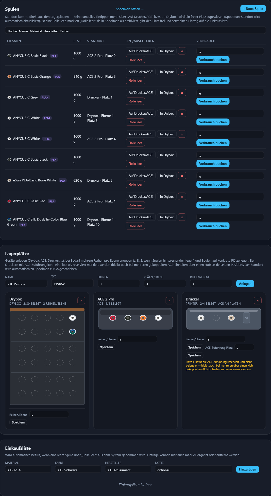

# Filament-Lager (Testversion)

Eigenstaendiges Lagerverwaltungs-System fuer 3D-Druck-Filament: [Spoolman](https://github.com/Donkie/Spoolman) fuer die Spulenverwaltung, plus ein eigenes Lagerplatz-Modul, das Spulen konkreten physischen Plaetzen (Drucker, ACE-Einheit, Drybox, ...) zuordnet - inklusive Drag & Drop, Einkaufsliste bei leeren Rollen, visueller Lager-Ansicht, einem eigenen Label-Designer fuer Etiketten (mit QR/Barcode-Export als PNG/PDF) und einem Scan-gestuetzten Workflow fuer Wareneingang und Lagerplatz-Zuordnung.

Diese Version ist bewusst eigenstaendig gehalten (reines `docker compose`) und laeuft ohne die Produktiv-Infrastruktur (Docker Swarm, Traefik, HAProxy, GlusterFS), auf der das Original laeuft - das heisst: laeuft unveraendert auf **Docker Desktop** (Windows/Mac) oder jedem Linux-Host mit Docker + Compose-Plugin.

## Screenshot



## Voraussetzungen

- Docker Desktop (Windows/Mac) oder Docker + Compose-Plugin (Linux)
- Der `storage`-Dienst baut auf einem Playwright/Chromium-Basisimage auf (fuer den Label-PNG/PDF-Export) - das Image ist entsprechend groesser, der erste `docker compose up -d` dauert daher beim Bauen etwas laenger als bei einem schlanken Python-Image.

## Starten

```bash
docker compose up -d
```

Danach:

- Dashboard: http://localhost:8093
- Spoolman (vollstaendige Oberflaeche): http://localhost:8091

Ports lassen sich ueber eine `.env`-Datei anpassen (Vorlage: `.env.example`).

## Was ist zu testen?

Grundfunktionen:

- Spulen in Spoolman anlegen (Material, Hersteller, Farbe, auch mehrfarbig)
- Lagerplaetze konfigurieren (Dashboard -> Lagerplaetze): Drucker, ACE-Einheit, Drybox
- Spulen per Drag & Drop bzw. Zuweisungsdialog ('Auf Drucker/ACE', 'In Drybox') auf Plaetze legen
- Auf einen Spulennamen in der Tabelle klicken -> Detail-/Edit-Modal oeffnet sich (Preis, Gewichte, Lot-Nr., Kommentar, Temperatur-Overrides, Filament-Typ-Felder)
- 'Rolle leer' testen (archiviert die Spule in Spoolman, gibt den Platz frei, setzt einen Eintrag auf die Einkaufsliste)
- Suche und Pagination im Spulenverzeichnis
- Panel-Reihenfolge im Dashboard ueber den Einstellungen-Button anpassen

Label-Designer (eigener Menuepunkt im Dashboard):

- Eigene Etikettenvorlagen per Drag & Drop zusammenstellen (Text mit Spoolman-Variablen wie Name/Material/Hersteller/Farbe, Spulen-Icon, Farbfeld, Barcode/QR-Code)
- QR-Code enthaelt automatisch das App-Logo im Zentrum eingebettet
- QR-Inhalt folgt dem Schema `WEB+SPOOLMAN:S-<spool_id>` bzw. `WEB+SPOOLMAN:F-<filament_id>` (kompatibel zum Scan-Format des Spoolman-eigenen Label-Designers)
- Vorlagen als PNG oder PDF exportieren (laeuft ueber Headless Chromium im `storage`-Dienst) und mit einem Etikettendrucker/Laserdrucker ausdrucken

Scan-gestuetzter Workflow (fuer Barcode-/QR-Scanner mit HID-Tastatur-Emulation, kein Treiber noetig):

- Spulen-ID wird direkt in der Spulen-Tabelle angezeigt
- Slot-Label-Generierung und Druckansicht fuer Lagerplaetze
- Scan-Overlay mit Statusanzeige beim Scannen
- Im 'Neue Spule'-Dialog kann ein gedrucktes Filament-QR-Label gescannt werden, um Material/Hersteller/Farbe automatisch vorzubefuellen

Rueckmeldungen, Bugs, Verbesserungsvorschlaege gerne als Issue in diesem Repo.

## Aufbau

```
docker-compose.yml
dashboard/    Frontend (nginx, statische SPA) + Reverse-Proxy zu Spoolman/Storage
storage/      Eigenes Lagerplatz- und Label-Backend (FastAPI + SQLite + Playwright/Chromium fuer Label-Export)
```

Spoolman selbst laeuft als offizielles Image (`ghcr.io/donkie/spoolman`), Konfiguration/Doku dort: https://github.com/Donkie/Spoolman

## Daten

Beide Datenbanken (Spoolman, Lagerplaetze/Label-Vorlagen) starten leer und liegen in benannten Docker-Volumes (`spoolman_data`, `storage_data`). Zum Zuruecksetzen: `docker compose down -v`.

## Bekannte Einschraenkungen (Stand dieser Version)

- Der Label-Designer zeigt im Editor aktuell nur einen Platzhalter fuer QR-Codes an (kein Live-Rendering waehrend der Bearbeitung), der Export selbst enthaelt einen echten QR-Code.
- Der vollstaendig scan-only durchgefuehrte Wareneingang (Spule automatisch anlegen und Lagerplatz automatisch zuweisen allein durch Scannen, ohne jede manuelle UI-Interaktion) ist noch nicht umgesetzt - aktuell braucht das Anlegen einer neuen Spule weiterhin den 'Neue Spule'-Dialog (der Scan darin befuellt aber bereits automatisch die Felder).

## Status

Fruehe Testversion - nicht fuer den produktiven Einsatz gedacht, kein Support-Anspruch.
